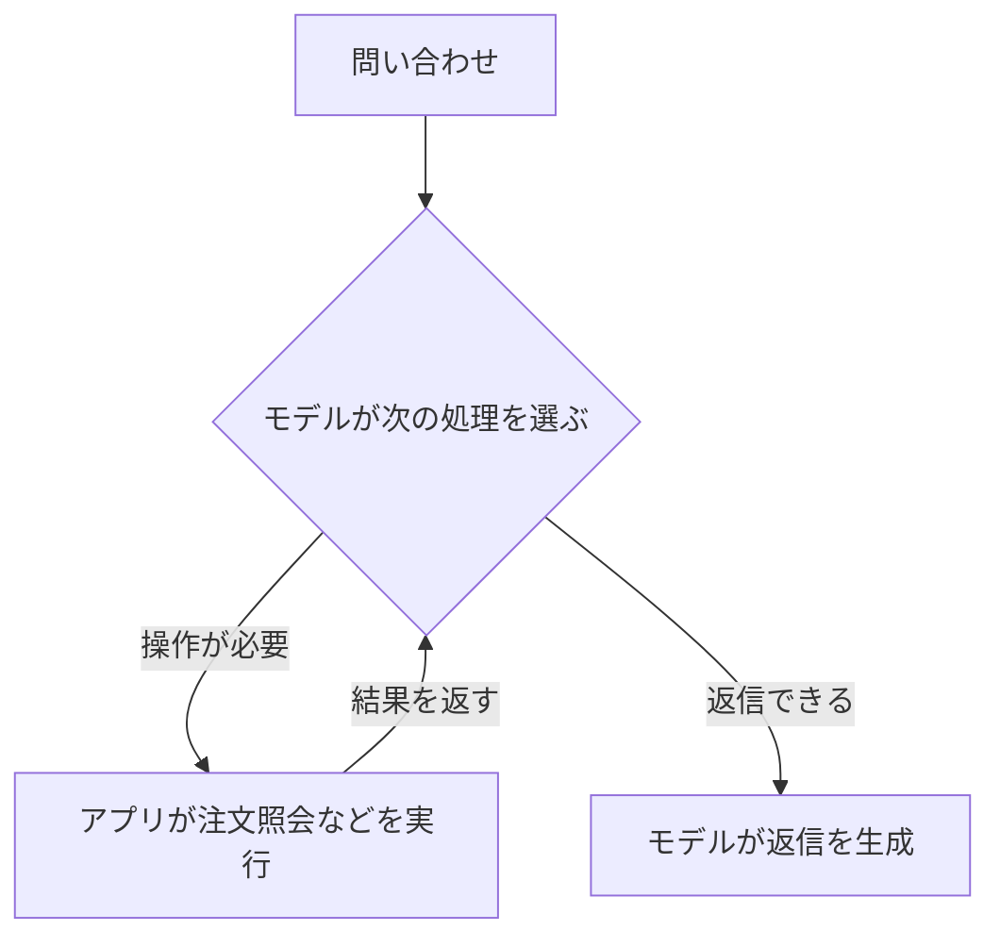
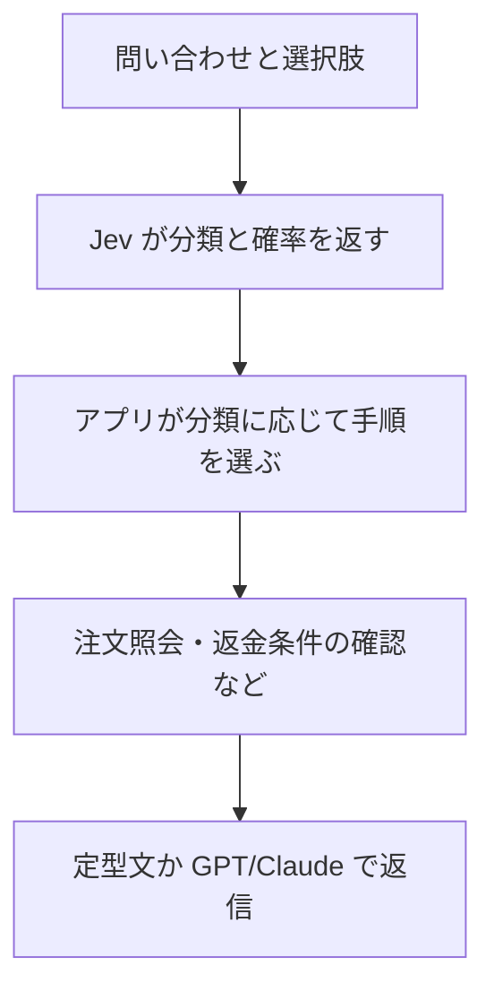

## TL;DR

- GPT/Claude: 生成も判断もこなす汎用モデル
- Jev: 判断と確率に特化。文章は生成しない
- 判断精度の優劣は用途次第。実データで比較が必要

## 返す答えの違い

| 用途 | GPT/Claude | Jev |
| --- | --- | --- |
| 文章/コード | できる | できない |
| 分類や評価 | できる | 主な用途 |
| 判断の出力 | 指定した形式で返せる | 判断と確率を返す |
| 理由の説明 | 文章で説明できる | 説明文は生成しない |

Jev は「質問、依頼、報告のどれか」のように、用意した選択肢や尺度に沿って答えるモデルだ。[[1]](#reference-1)

たとえば、果物について質問するなら、次のように選択肢も一緒に渡す。

| 項目 | 例 |
| --- | --- |
| 質問 | 赤くて、青森県産が有名な果物はどれ？ |
| 選択肢 | りんご、バナナ、ぶどう |
| 出力のイメージ | 「りんご」という選択結果と、各選択肢の確率 |

GPT や Claude も、アプリが読める決まった形式で答える**構造化出力**を使えるため、分類だけなら両方に任せられる。[[2]](#reference-2)
違いは、判断と確率を返す用途に、設計と学習の狙いを絞っていることにある。
Jev は Codex のようにコードを書く道具ではない。

## 学習の目標の違い

| 比較点 | GPT/Claude | Jev |
| --- | --- | --- |
| 目標 | 生成や推論など幅広い能力 | 判断と確率に特化 |
| 確率 | 指示だけで正答率との一致は保証されない | 予測と結果の一致も学習目標 |

GPT や Claude も、出力への評価をもとに改善する**強化学習**によって、推論や課題解決の能力を鍛えている。[[3]](#reference-3)
Jev は **RLCD** という学習方法で、判断に加えて、予測した確率と実際の当たり具合が合うことを目指す。
この一致を**較正**という。[[4]](#reference-4)

たとえば「80%」を付けた案件を多数集めたとき、約 80% が正解になる状態だ。
個々の回答の正しさを保証するものではなく、自社のデータでも同じように当たるかは確認が必要になる。
なお、Jev の `confidence` は確率分布から計算した別の指標で、「0.9 なら正答率 90%」とは読めない。[[5]](#reference-5)

## 処理の仕組みの違い

| 比較点 | GPT/Claude | Jev |
| --- | --- | --- |
| 出力 | 文章やデータの断片を順に生成 | 判断の確率を並列に出力 |
| 複数質問 | まとめて回答させる構成も可能 | 同じ情報から独立に答えられる質問を並列処理 |
| 速さと費用 | モデルや推論量などで変わる | 短い判断を低コストで返す設計 |

Jev の仕組みと速度上の利点は、TypeSafe による説明だ。[[6]](#reference-6)
実際の速度と費用は、同じ仕事を任せて比較する必要がある。

Jev でも、前の答えや追加の情報を待たなければ解けない質問は、一度に処理できない。[[7]](#reference-7)
たとえば注文情報を調べてから判断するなら、情報を取得し、その結果を渡して呼び出す手順が必要になる。

## 問い合わせアプリでの使い方の例

「届いた商品が壊れていたので返金してほしい」という問い合わせを処理する例だ。
GPT や Claude は、アプリに操作を要求する**ツール呼び出し**を使って対応を進められる。[[8]](#reference-8)
Jev は、選択式の判断と各候補の確率を、アプリの処理分岐に使える。[[9]](#reference-9)

どちらも、注文の取得、返金条件の確認、返金の実行はアプリ側に必要になる。
GPT に分類だけさせることも、Jev に次の操作を選ばせることもできるため、図はモデルごとの必須構成ではない。
同じ役割でモデルを入れ替える場合、主に変わるのは判断の精度、確率の扱い、費用、待ち時間だ。

## 用途に応じた選び方

| 任せたい仕事 | 候補 |
| --- | --- |
| 調査や文章/コード生成 | GPT/Claude |
| 分類や評価の反復 | Jev を比較候補に入れる |
| 分類して文章化 | Jev と GPT/Claude の併用 |

Jev は、小さな判断を繰り返す処理に用途を絞った選択肢だ。
フロンティアモデルとの使い分けは、任せる仕事の範囲と、その仕事での評価結果から決める。

## 参考文献

1. [公式のモデル説明](https://docs.typesafe.ai/concepts/system-one)
2. [Claude の構造化出力](https://platform.claude.com/docs/en/build-with-claude/structured-outputs)
3. [Anthropic の強化学習に関する説明](https://alignment.anthropic.com/2026/reward-seeker/)
4. [公式の学習方針](https://docs.typesafe.ai/introduction/machine-learning-primer)
5. [確率と confidence の違い](https://docs.typesafe.ai/confidence)
6. [公式発表の設計説明](https://typesafe.ai/blog/introducing-system-one-models-and-jev)
7. [複数の質問の扱い](https://docs.typesafe.ai/primitives)
8. [Claude のツール呼び出し](https://platform.claude.com/docs/en/agents-and-tools/tool-use/overview)
9. [選択式の質問の仕様](https://docs.typesafe.ai/primitives/choice)
